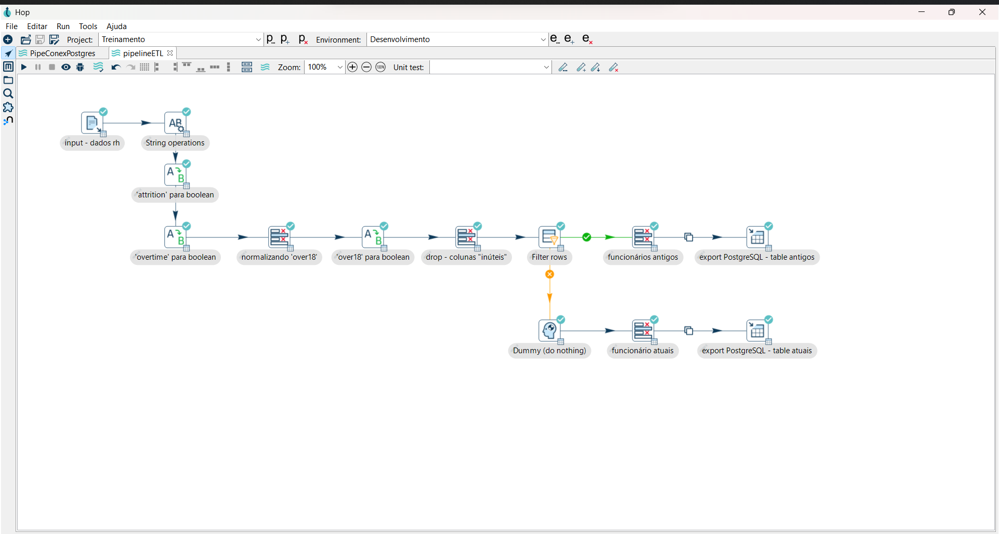

# Pipeline ETL - Apache HOP

Este projeto consiste na construção de uma pipeline ETL usando o Apache Hop para tratamento e padronização de um conjunto de dados de funcionários obtido do Kaggle. O fluxo realiza transformações básicas e separa os dados em dois grupos: funcionários antigos (que deixaram a empresa) e atuais (que permanecem na empresa). Os dados transformados são então exportados para tabelas no PostgreSQL, gerenciado via pgAdmin.

## 🛠️ Stacks Utilizadas

- **Apache Hop:** Ferramenta de ETL para transformar e processar dados.
- **PostgreSQL:** Banco de dados relacional utilizado para armazenar os dados tratados.
- **pgAdmin:** Interface gráfica para gerenciar o banco PostgreSQL.
- **Kaggle:** Plataforma onde os dados originais de funcionários foram obtidos. 

## 📂 Arquitetura do Projeto

1. Input - Kaggle Dataset
    - O dataset contém informações de funcionários de uma empresa fictícia, incluindo detalhes como over time, attrition (se o funcionário saiu), e idade maior de 18 anos.

2. Transformações no Apache Hop
    As seguintes transformações foram realizadas no dataset:

    - Conversão de colunas para boolean:
        - 'attrition' para boolean 
        - 'overtime' para boolean
        - 'over18' para boolean
    - Drop de colunas inúteis: Excluímos colunas irrelevantes para a análise.
    - Separação de registros usando o nó Filter rows:
        - Funcionários antigos.
        - Funcionários atuais.

3. Exportação para PostgreSQL
    - Utilizamos duas tabelas para armazenar os dados:
        - funcionário_atuais: Funcionários que permanecem na empresa.
        - funcionário_antigos: Funcionários que saíram.
    - A conexão com o banco de dados PostgreSQL foi realizada pelo Apache Hop e gerenciada via pgAdmin.

## 📊 Fluxo da Pipeline

- **Arquivo de entrada:** Carregamento dos dados do Kaggle.
- **Transformações:** Padronização e normalização dos dados com múltiplas operações.
- **Filtragem:** Separação entre funcionários atuais e antigos com base na coluna de attrition.
- **Exportação:** Envio dos dados para duas tabelas PostgreSQL.

## 🤝 Contribuição
Contribuições são bem-vindas! Sinta-se à vontade para entrar em contato para conversarmos e discutirmos possibilidades.
